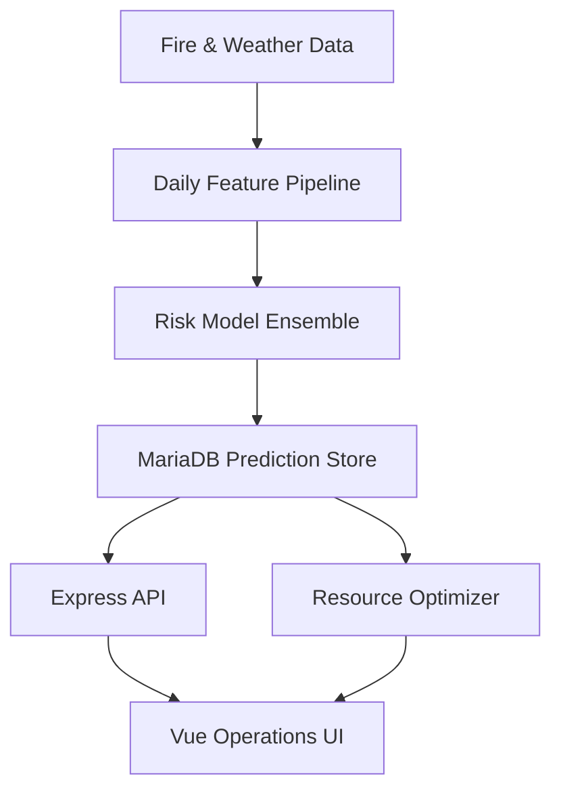

# Fire Risk & Resource Optimizer

> 전국 시군구의 일별 화재 발생·확산·장기점유 위험을 예측하고, 제한된 소방 인력을 위험도에 따라 재배치하는 의사결정 지원 플랫폼입니다.

## Overview

이 프로젝트는 예측 모델을 만드는 데서 끝나지 않고, 일일 배치 예측 → REST API → 지도 기반 운영 화면 → 자원배치 최적화까지 하나의 서비스로 연결합니다.



## My Contribution

- 화재 위험 예측 모델군 전체 설계·학습·평가
- M0 폴백부터 M1·M2a·M3·M4·M5까지 모델 파이프라인 구현
- 실시간 기상 수집 실패를 고려한 폴백과 일일 배치 설계
- 대시보드, 지역 상세, 검증, 운영, 자원배치 화면 전체 UI 구현
- 소방 인력 재배치 목적함수·제약조건 설계 및 최적화 구현
- 예측 결과, 최적화 결과, 운영 상태를 연결하는 API·DB 구조 통합

## Model Pipeline

| Model | Purpose | Method | Status |
|---|---|---|---|
| M0 | 지역·계절 기저 화재건수 | Lookup baseline | Production fallback |
| M1 | 일별 화재 발생건수 | LightGBM Poisson + `log(M0)` offset | Primary |
| M5 | 1건 이상 발생확률 | Isotonic calibration | Primary |
| M2a | 연소 확대 위험 | LightGBM binary | Primary |
| M3 | 화재 원인 | LightGBM multiclass | Reference signal |
| M4 | 120분 이상 현장점유 | LightGBM binary | Reference signal |

M1은 지역 평균과 계절성을 M0로 먼저 설명하고, 날씨와 지역 특성이 만드는 잔차만 학습하도록 설계했습니다. 데이터나 외부 기상 공급원이 불완전할 때는 조용히 실패하지 않고 M0로 폴백하며 실행 기록에 원인을 남깁니다.

## Evaluation Highlights

2021~2022년을 학습 구간, 2023년을 홀드아웃으로 사용한 저장소의 평가 리포트 기준입니다.

| Metric | Result |
|---|---:|
| M1 Poisson deviance | 0.8892 |
| M0 region × season deviance | 0.9108 |
| M1 calibration | 0.9803 |
| M1 recall@20% | 0.3917 |
| M2a PR-AUC | 0.5502 |
| M2a base rate | 0.2968 |
| M4 120-minute ROC-AUC | 0.8449 |

낮을수록 좋은 Poisson deviance에서 M1이 M0를 개선했습니다. M3는 고정 상위 3개 원인 기준선을 넘지 못해 단독 의사결정 모델로 채택하지 않고 참고 신호로 제한했습니다. M4도 절대 정확도가 낮아 단독 배치 근거가 아닌 보조 지표로만 사용합니다.

## Resource Allocation

지역별 예상 대응 부담을 다음과 같이 정의합니다.

$$
d_r = \lambda_r (1 + q_r)(1 + \ell_r)
$$

- $\lambda_r$: 예상 화재건수
- $q_r$: 확산 위험
- $\ell_r$: 장기점유 위험

시·도별 총 인력은 보존하면서 위험가중 미충족을 최소화합니다.

$$
\min_x \sum_r d_r \max(0, need_r - x_r)
$$

제약조건은 다음과 같습니다.

- 인력은 같은 시·도 안에서만 이동
- 각 지역에 현재 인력의 최소 비율 $\alpha$ 유지
- 지역별 배치 상한 $\beta$
- 하루 조정 가능 인원 $\delta$
- 시·도별 총 인력 보존

목적함수의 한계이득이 단조 감소하는 구조를 이용해 위험가중치가 큰 지역부터 배분합니다. `scripts/alloc_optimize.py`에서 SciPy LP 결과와 비교해 동일한 최적 목적값을 검증합니다.

실제 출발지·도착지와 이동시간 데이터가 없기 때문에 현재 범위는 출동 경로 최적화가 아니라 **지역 단위 사전배치(pre-positioning)** 입니다.

## Service Components

- `ml/`: 피처 생성, 학습, 평가, 일일 예측 배치
- `models/`: M0 폴백, 캘리브레이션과 평가 메타데이터
- `backend/`: Express·TypeScript API와 자원배치 서비스
- `frontend/`: Vue 3 기반 지도·운영 대시보드
- `sql/`: 예측·참조·운영 테이블과 검증 뷰
- `deploy/`: Nginx, systemd, cron 운영 설정
- `scripts/`: 학습·가정 검증·최적화 재현 스크립트

원본 대용량 CSV, 캐시, 발표자료, PDF, 생성형 시각화와 개발 산출물은 공개용 저장소에서 제외했습니다. 용량이 큰 LightGBM 가중치는 코드 저장소에 직접 넣지 않고, 학습 스크립트로 재생성하거나 릴리스·오브젝트 스토리지에서 버전 관리하는 구성을 전제로 합니다. 저장소만으로 실행하면 M0 폴백을 사용할 수 있습니다.

## API Areas

- 일별 전국 위험 지도와 지역 상세
- 고위험 일자 조회
- 확산·원인·장기점유 신호
- 데이터 신선도와 배치 실행 상태
- 모델 검증 지표
- 정책값별 소방 인력 재배치안

## Tech Stack

| Layer | Technology |
|---|---|
| ML | Python, pandas, scikit-learn, LightGBM |
| Optimization | Python/SciPy verification, TypeScript greedy solver |
| Backend | Node.js, Express, TypeScript |
| Frontend | Vue 3, Pinia, Vite |
| Database | MariaDB/MySQL |
| Operations | Linux, Nginx, systemd, cron, environment variables |
| External data | Open-Meteo weather API |

## Run

### 1. Environment

```bash
cp .env.example .env
python -m venv .venv
source .venv/bin/activate
pip install -r requirements.txt
```

### 2. Database

MariaDB에 `sql/schema_00_ddl_all.sql`을 적용하고 참조 데이터를 적재합니다.

### 3. Daily prediction

```bash
PYTHONPATH=ml/src python -m fire_ml.batch.run_daily --date 2026-09-18
```

### 4. API

```bash
cd backend
npm ci
npm run dev
```

### 5. Frontend

```bash
cd frontend
npm ci
npm run dev
```

## Test

```bash
cd ml && pytest
cd ../backend && npm test
```

## Reliability Decisions

- 모델 아티팩트 일부가 없으면 M0 단독 모드로 동작합니다.
- 예측 불가 지역도 누락시키지 않고 `데이터없음` 상태로 남깁니다.
- 외부 기상 실패 시 관측 데이터, 이후 M0 순서로 폴백합니다.
- 결측 대응 부담을 0으로 채워 위험이 없는 것처럼 보이게 하지 않습니다.
- 250개 지역 마스터가 완전하지 않으면 일일 배치를 실패 처리합니다.
- 모델별 채택 기준과 실패 모델의 제한 사항을 평가 리포트에 남깁니다.

## Limitations & Next Steps

- 소방 인력은 지역별 추정치가 포함되어 실제 운영 전 검증이 필요합니다.
- 이동거리·교통·차량·장비 가용성 데이터가 없어 경로 최적화는 제외했습니다.
- 클라우드 배포를 위해 컨테이너 이미지, IaC, Secret Manager 연동이 필요합니다.
- GitHub Actions 기반 테스트·빌드·배포와 모델 아티팩트 버전 관리가 필요합니다.
- 운영 단계에서는 예측 드리프트, 데이터 지연, API 오류율과 배치 실패를 모니터링해야 합니다.
